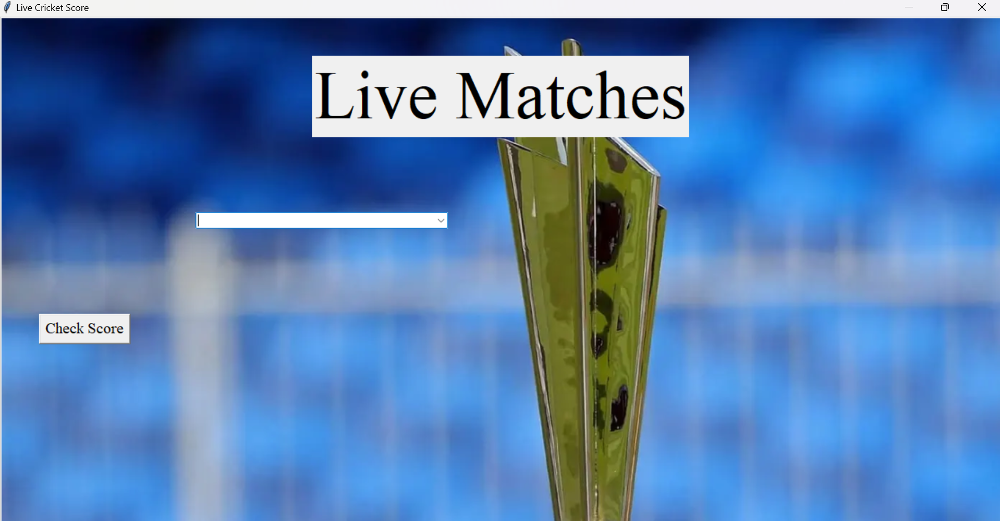
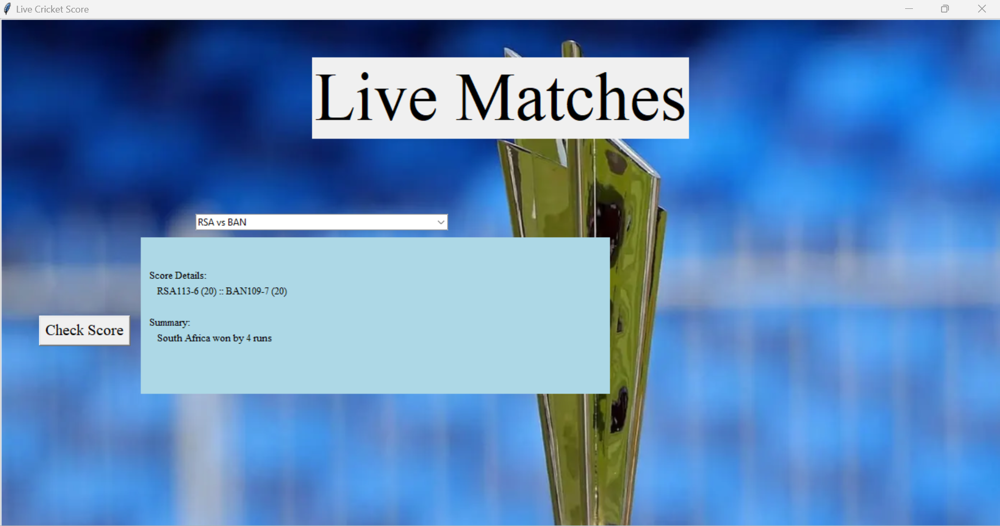

# CrickTrack

## Table Of Contents
- Overview
- Core Concepts
- Languages and Libraries
- Demo

## Overview

With the Cricket World Cup 2024 coming up, it would be great to have a way to track the scores of ongoing matches while I am working on my computer. So why don't I create a cricket score tracker (CrickTrack) myself! The goal of this project is to create an application which has a purposeful use-case for me, while also learning about different concepts and techniques like web-scraping, HTTP Requests, GUI design, etc.
 
## Core Concepts

- Application Development
- Graphical User Interfaces (GUIs)
- HTTP Requests
- Web Scraping
- HTML Parsing
- Regular Expressions, String Matching, and String Algorithms

## Languages and Libraries
- Python
- Tkinter
- BeautifulSoup
- Requests
- RE (RegEx)

## Demo

- State of the app when it is first loaded:

- Select one of the ongoing live matches from the dropdown menu

- Press the check score button to view the details of the match:

It looks like the South African cricket team took the 2 points today against Bangladesh!!!